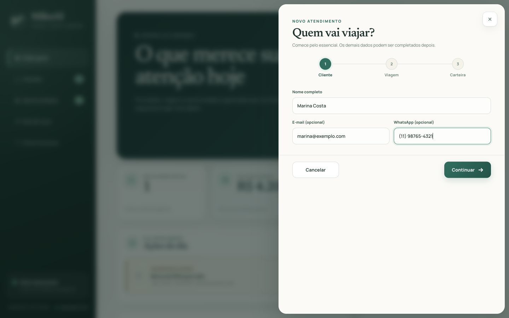
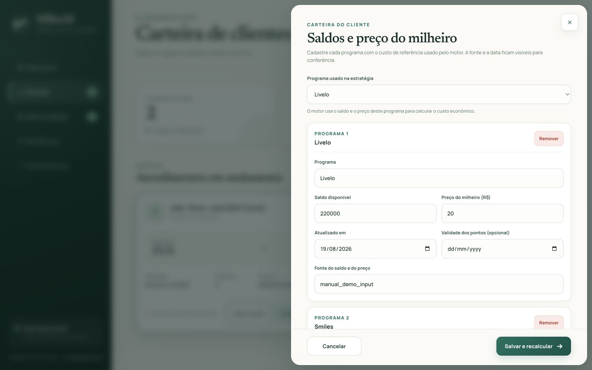
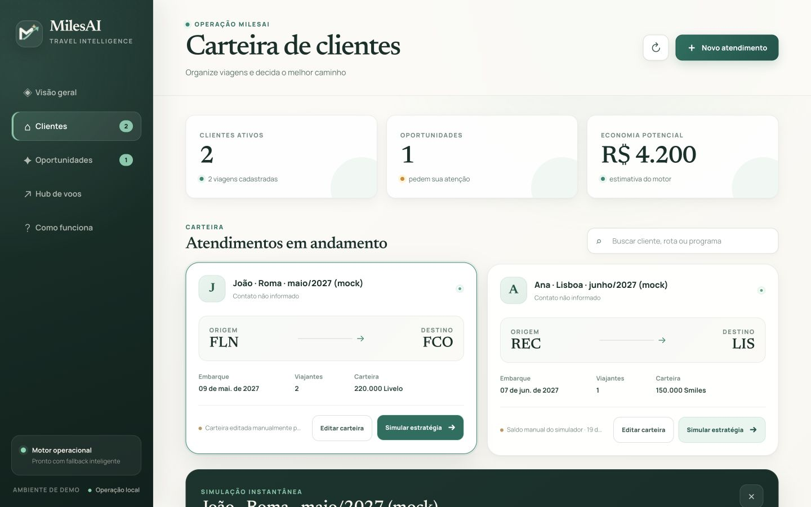
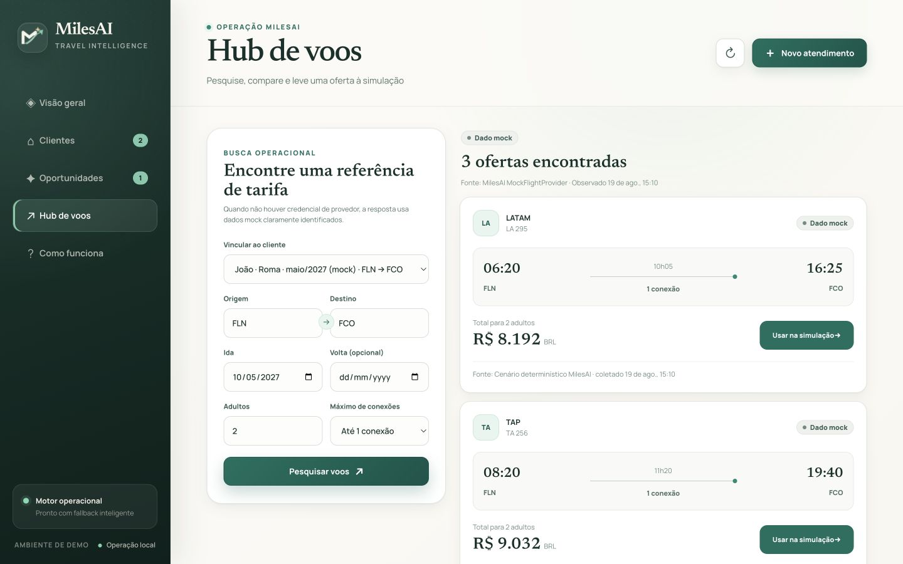
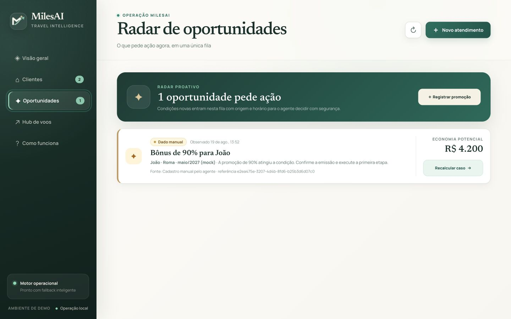

# MilesAI

> Cockpit de decisão para pequenos agentes de viagem: organiza clientes e carteiras, compara dinheiro, pontos e milhas, monitora condições e transforma eventos em oportunidades acionáveis.

Projeto criado durante o **OpenAI Hackathon Brasil**, no desafio **Pequenos Negócios**.

## O que está funcionando

A tela principal agora é um cockpit operacional multi-cliente:

- dashboard operacional com ações do dia, viagens, oportunidades, saúde das carteiras e atividade recente;
- cadastro progressivo de cliente, contato, viagem e carteira;
- máscara brasileira de WhatsApp, validação imediata de e-mail e normalização de aeroportos IATA;
- carteira editável com múltiplos programas, saldo, vencimento, fonte e preço do milheiro;
- persistência em PostgreSQL, inclusive após reload ou reinício do app;
- motor determinístico sem números calculados por IA;
- comparação entre dinheiro, pontos próprios e cotação de milhas;
- laboratório para alterar preço cash, saldo, milhas, taxas, disponibilidade e bônus;
- hub de voos com adapter SerpApi opcional e fallback mock determinístico;
- aplicação da tarifa pesquisada ao caso antes do recálculo;
- promoções manuais auditáveis com origem e horário;
- matching seletivo em toda a carteira;
- oportunidades e execuções deduplicadas;
- worker separado e healthcheck real do banco;
- funcionamento completo sem chave OpenAI;
- página didática completa em `/como-funciona`, com tour, glossário, fontes dos dados, limites e FAQ.

A experiência visual foi desenhada para uso diário do agente: identidade própria MilesAI, marca vetorial baseada em rota, tipografia Manrope + Newsreader embarcada localmente, escala mínima de 11 px para metadados, foco visível, alvos de toque de 42–46 px e layouts específicos para desktop, tablet e mobile. Nenhuma fonte depende de CDN durante a demo.

O roteiro original do MVP P0 continua disponível em `/demo`.

Vídeos curtos da demonstração:

- V1 original, 56s: [`artifacts/milesai-demo/MilesAI-demo-56s.mp4`](artifacts/milesai-demo/MilesAI-demo-56s.mp4);
- V2, 47s, com locução brasileira mais conversada e legendas sincronizadas: [`artifacts/milesai-demo-v2/MilesAI-demo-v2.mp4`](artifacts/milesai-demo-v2/MilesAI-demo-v2.mp4).
- V3, 44s, captura de uso real sem áudio e sem legendas queimadas: [`artifacts/milesai-demo-v3/MilesAI-demo-v3-sem-audio.mp4`](artifacts/milesai-demo-v3/MilesAI-demo-v3-sem-audio.mp4). O roteiro separado está em [`legendas-v3.txt`](artifacts/milesai-demo-v3/legendas-v3.txt).

Os três usam capturas reais do cockpit e identificam explicitamente o Hub mock.

Apresentação para o pitch de até 3 minutos:

- 6 slides com notas do apresentador: [`artifacts/milesai-pitch/MilesAI-Pitch-3min.pptx`](artifacts/milesai-pitch/MilesAI-Pitch-3min.pptx).

## Screenshots da demonstração

Todas as telas abaixo foram capturadas do build Docker funcional. Os dados simulados aparecem identificados na interface.

| Dashboard operacional | Cadastro de atendimento |
|---|---|
| [](artifacts/milesai-demo/scenes/01-dashboard.jpg) | [](artifacts/milesai-demo/scenes/02-cadastro.jpg) |

| Carteira e valor do milheiro | Estratégia calculada |
|---|---|
| [](artifacts/milesai-demo/scenes/03-carteira.jpg) | [](artifacts/milesai-demo/scenes/04-estrategia.jpg) |

| Hub de voos com mock identificado | Central de oportunidades |
|---|---|
| [](artifacts/milesai-demo/scenes/05-hub-mock.jpg) | [](artifacts/milesai-demo/scenes/06-oportunidades.jpg) |

| Página Como funciona | Dashboard mobile em 390 px |
|---|---|
| [](artifacts/milesai-demo/scenes/07-como-funciona.jpg) | [](artifacts/milesai-demo/scenes/08-dashboard-mobile.jpg) |

## Acessar com Docker

Requisitos: Docker Desktop e Docker Compose.

```bash
cp .env.example .env
docker compose up --build -d
```

Acesse:

- cockpit operacional: <http://localhost:3107>
- como funciona: <http://localhost:3107/como-funciona>
- demo original P0: <http://localhost:3107/demo>
- saúde do app/banco: <http://localhost:3107/api/health>

Para escolher outra porta:

```bash
MILESAI_PORT=3110 docker compose up --build -d
```

Operação:

```bash
docker compose ps
docker compose logs -f milesai worker
docker compose down
```

O volume `milesai_postgres` preserva os cadastros. `docker compose down` não apaga o volume.

## Primeiro uso

O banco recebe dois casos seed marcados como mock:

- João · Roma · Livelo → TAP;
- Ana · Lisboa · Smiles → Flying Blue.

Fluxo recomendado para testar:

1. Clique em **Novo atendimento** e cadastre uma rota diferente.
2. Clique em **Simular estratégia**.
3. Abra **Editar carteira** e ajuste saldo, validade ou valor do milheiro.
4. Abra **Ajustar oferta, taxas e bônus**, altere um valor e salve.
5. Entre no **Hub de voos**, pesquise a rota e use uma oferta na simulação.
6. Entre em **Oportunidades** e registre uma promoção compatível.
7. Confira que somente os casos compatíveis geraram oportunidade.
8. Recarregue a página para confirmar a persistência.

## Dados reais e mockados

Cada valor volátil mantém fonte e horário. O produto não mistura dados silenciosamente.

- Sem `SERPAPI_API_KEY`, o hub retorna ofertas determinísticas marcadas como **Dado mock**.
- Com `SERPAPI_API_KEY`, a pesquisa cash usa SerpApi/Google Flights e marca as ofertas como **Dado live**.
- Saldos, emissões award, cotações de milhas e promoções cadastradas no piloto são manuais ou mockadas.
- Toda tarifa e disponibilidade live deve ser revalidada antes da compra.

Não existe feed público oficial seguro para promoções Livelo/Smiles/LATAM Pass/Azul. Por isso o piloto usa cadastro manual com fonte, prazo e confirmação humana. Não faz scraping autenticado, compra, emissão nem transferência automática.

## OpenAI e fallback

A OpenAI é opcional. Na demo P0, ela pode estruturar o pedido e explicar o resultado usando Responses API + Structured Outputs. No cockpit operacional, os formulários estruturados são o fallback completo: sem chave, nenhum texto é trocado silenciosamente pelo caso de João.

```dotenv
OPENAI_API_KEY=
OPENAI_MODEL=
SERPAPI_API_KEY=
POSTGRES_PASSWORD=milesai_local
MILESAI_PORT=3107
```

## Arquitetura

```text
Browser
  └── Next.js 16 / React 19
        ├── CRUD de casos e avaliação
        ├── hub de voos
        │     ├── SerpApiFlightProvider (opcional)
        │     └── MockFlightProvider (fallback identificado)
        ├── motor TypeScript determinístico
        ├── eventos e oportunidades idempotentes
        └── PostgreSQL 17
                ├── tenants
                ├── cases (snapshots JSONB)
                ├── strategy_runs
                ├── promotion_events
                └── opportunities

worker Docker
  └── aciona o monitor a cada 30 segundos
```

Todo agregado possui `tenant_id`; o piloto usa um tenant local padrão. Autenticação e isolamento por sessão são obrigatórios antes de armazenar PII real ou publicar o cockpit na internet.

## APIs principais

| Método | Rota | Uso |
|---|---|---|
| `GET/POST` | `/api/cases` | listar e criar atendimentos |
| `GET/PATCH/DELETE` | `/api/cases/:id` | ler, atualizar e remover um caso |
| `POST` | `/api/cases/:id/evaluate` | salvar uma execução do motor |
| `POST` | `/api/flights/search` | pesquisar ofertas cash live/mock |
| `GET` | `/api/opportunities` | central proativa |
| `POST` | `/api/opportunities/promotion` | registrar evento e fazer matching |
| `POST` | `/api/monitor/run` | processar eventos em lote |
| `GET` | `/api/health` | readiness do PostgreSQL |

Erros de validação retornam `400`, recursos ausentes `404` e operações de criação `201`.

## Desenvolvimento e testes

Requisitos locais: Node.js 20+ e pnpm 11.

```bash
pnpm install
pnpm test
pnpm lint
pnpm build
```

Ou execute a verificação completa:

```bash
pnpm check
```

A suíte cobre o P0 e a onda operacional, incluindo:

- bônus e arredondamento do motor;
- saldo, disponibilidade e dados ausentes;
- Ana e João com entradas e resultados próprios;
- edição seguida de recálculo;
- matching seletivo multi-caso;
- alerta idempotente;
- proveniência mock/live/mixed;
- adapter mock de pesquisa de voos;
- fallback sem OpenAI;
- múltiplos programas, unicidade da carteira e atualização auditável do milheiro.

Também foi executado smoke real contra PostgreSQL: seed, CRUD, avaliação, duas promoções seletivas e retry sem duplicação.

### QA visual e funcional

O build Docker de produção foi percorrido no navegador em desktop e mobile. A rodada cobre:

- navegação entre carteira, oportunidades e hub;
- busca e seleção de clientes;
- cadastro completo em três etapas, inclusive datas;
- simulação, fechamento por botão/Escape e laboratório de cenário;
- pesquisa mock de voos e aplicação da tarifa ao caso;
- cadastro de promoção e recálculo seletivo;
- feedback de loading, vazio, erro e origem dos dados;
- drawers, formulários, foco, contraste e overflow em 390 px.
- máscaras de WhatsApp, bloqueio de e-mail inválido e normalização de códigos IATA.

## Guardrails

- A emissão precisa ser confirmada antes de transferir pontos.
- Compra, transferência e emissão exigem ação humana fora do MilesAI.
- Dados cash live são cotação, não garantia de preço ou disponibilidade.
- Pesquisa award real depende de fornecedor e autorização comercial separados.
- Notificações externas por WhatsApp/e-mail ainda não são enviadas.
- Antes de uso público: autenticação, RLS/isolamento por sessão, consentimento LGPD, criptografia de PII e política de retenção.

## Referências do projeto

- especificação e ordem original: [`MilesAI_Hackathon_Spec.md`](MilesAI_Hackathon_Spec.md);
- fixtures P0: [`src/data`](src/data);
- motor: [`src/domain/strategy-engine.ts`](src/domain/strategy-engine.ts);
- domínio operacional/proveniência: [`src/domain/operational.ts`](src/domain/operational.ts).
